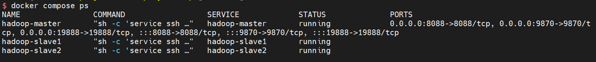
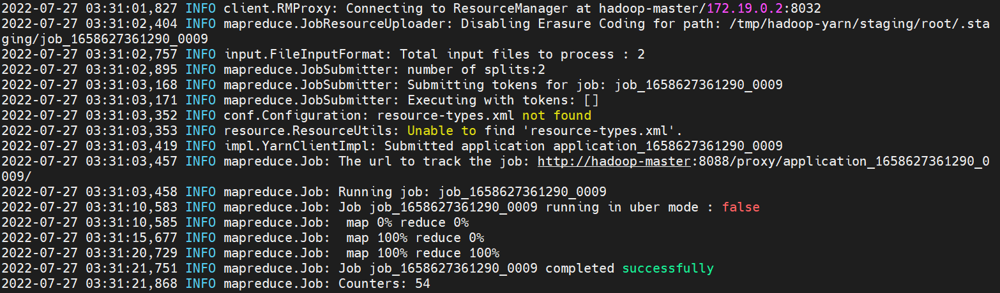

## Start your own Hadoop cluster with docker

|      | hadoop-master                 | hadoop-slave1 | hadoop-slave2 |
| ---- | ----------------------------- | ------------- | ------------- |
| HDFS | NameNode<br>SecondaryNameNode | DataNode      | DataNode      |
| YARN | ResourceManager<br>LogServer  | NodeManager   | NodeManager   |

### Prepare

- Docker(my version is 20.10.17)
  
  > just make sure `docker compose` can work

- Download [hadoop-3.2.4.tar.gz](https://github.com/non-one/HadoopDockerDemo/releases/download/dep/hadoop-3.2.4.tar.gz) and **Put the file in the same level directory of Dockerfile**

### Quick start

1. **Clone the repository**

2. **Build your own images**
   
   ```bash
   docker compose build
   ```

3. **Start docker**
   
   ```bash
   docker compose up -d
   ```

### Verify



```bash
docker exec -it hadoop-master bash
./start-hadoop.sh
./run-wordcount.sh
```

If successful, you will see



> **MapReduce UI:** http://\<HOST IP>:8080
> 
> **HDFS UI:** http://<HOST IP>:9870
> 
> **Log UI:**  http://<HOST IP>:19888

### 

### Q&A

1. Can I use it offline?
   
   >  NO, the docker base image  is ubuntu:18.04 that pulled from Internet，and  use **apt**  to install openssh, java8. 
   > 
   > In addition, at Dockerfile line-9，you can replace default sources.list to speed up apt installation.

2. How to increase the number of DataNode/NodeManager?
   
   > 1. edit config/works file.  Each line represents a Node.
   > 
   > 2. edit docker-compose.yml.
   > 
   > 3. go to **Quick start** step-2 rebuild your images.

### refer

https://github.com/kiwenlau/hadoop-cluster-docker
